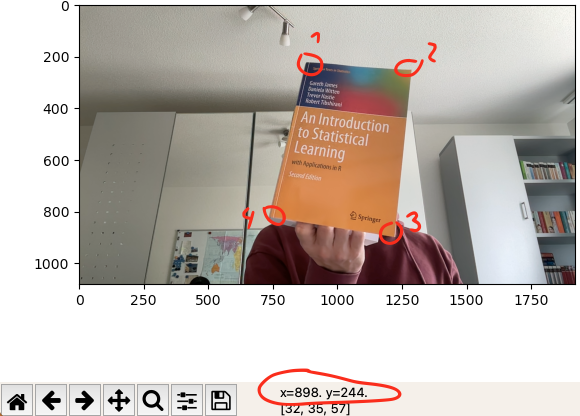
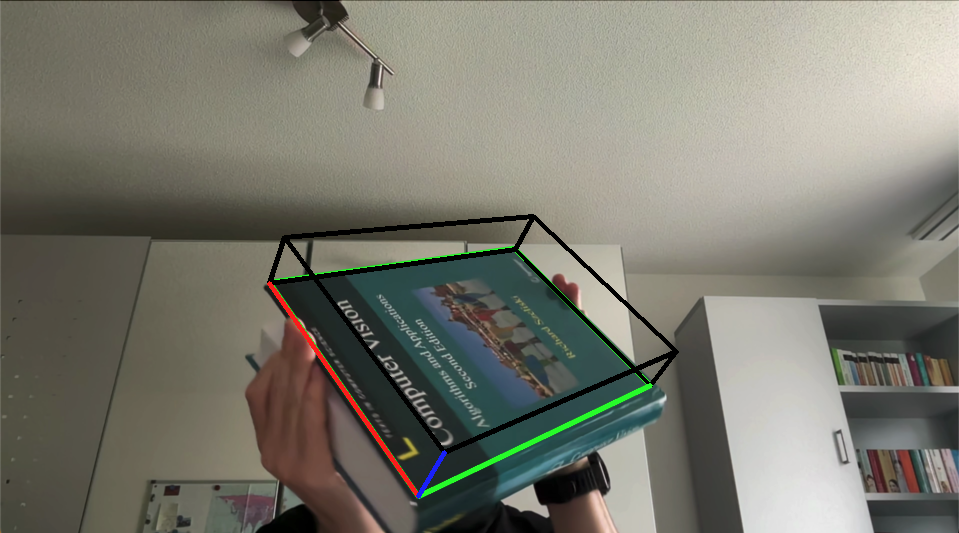
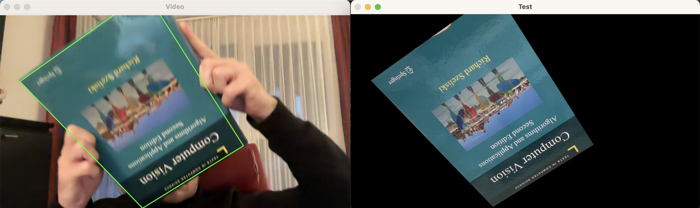

# Augmented Reality on Webcam
Show virtual object on plane of reference image. Use provided conda environment to test.

## Notes 
- RANSAC threshold may not be set too high because wrong matches corrupt the resulting homography.
- x_frame equals the size of the real object. E.g. plane of the reference object is 20.5cm*28.5cm then the x_frame should look like `[[0, 0], [205, 0], [205, 285], [0, 285]]` - format: [x,y]

## Register new reference object
To register a new reference object, do the following steps:
1. Take a picture of the reference object - you can use `image_capture.py` - and set the name 'reference-2' in the console. To take a picture, focus the webcam window and press the key 'y'. This will save the image to `images/reference-2-0.png`. Rename the file to `reference-2.png`.
2. Set fname in `unwarp_image.py` to the location of the image containing the new reference object and start `unwarp_image.py`
3. Hover the corner points of the planar object as given in the underneath image and write down the coordinates.

4. Set your coordinates in `unwarp_image.py`:
```
if fname == 'images/reference-2':
pts = np.array([
    (x1, y1), # top left
    (x2, y2), # top right
    (x3, y3), # bottom left
    (x4, y4) # bottom right
])
```
5. Restart `unwarp_image.py` which will write the unwarped image to `images/reference-2-cut.png`.
6. In `ar_webcam.py` set `ref_img_name` to `images/reference-2-cut.png` and add the "real world coordinates" of the reference object (see notes above):
```
if ref_img_name == 'images/reference-2-cut.png':
    x_frame = np.float32([[0, 0], [width, 0], [width, height], [0, height]]) # order: top left, top right, bottom right, bottom left
```
7. Start `ar_webcam.py` and verify that the image of your unwarped reference object is shown in the first window.

## Scale the augmented object
The augmented object can be scaled by updating `Dx`, `Dy` and `Dz` in `ar_webcam.py`. For example if you want to show an augmented object that is the same size as the reference object, you can use:
```
Dx = width
Dy = height
Dz = any
```
Where width and height correspond to the "real world coordinates". This will then look like this:


## Pose Estimation
The `warpPerspective` function from opencv can be used to warp the reference object to the estimated pose in the scene:


To activate the functionality, set `pose_estimation_active` to `True`.